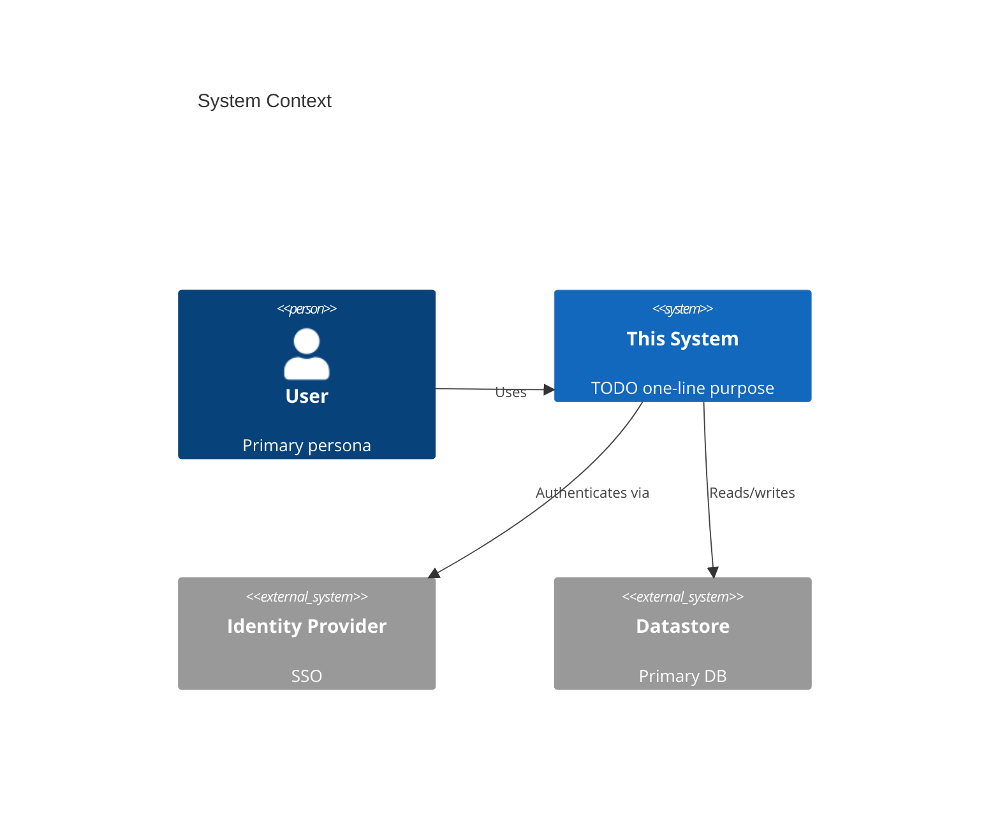
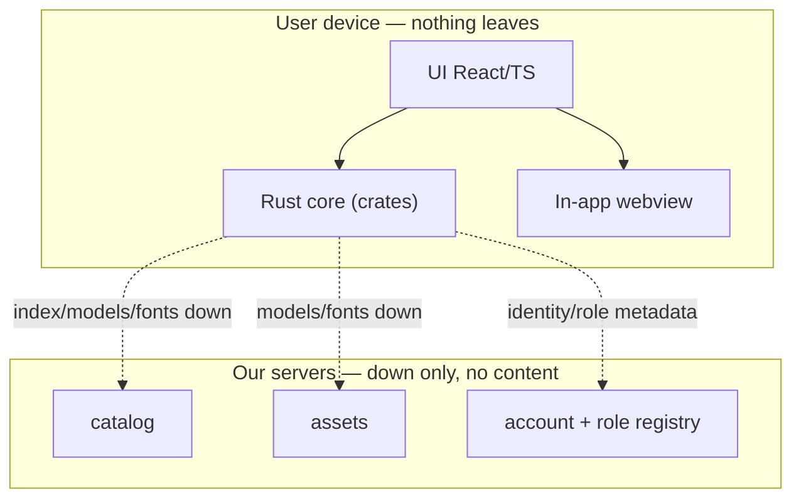

# Architecture (C4 model)

Describe the system at four zoom levels. Keep diagrams generated-from-text (Mermaid) so they diff
cleanly and stay in sync.

## 1. System Context (who uses it, what it talks to)

## 2. Containers (deployable units)
- **`apps/app`** — the native app (Tauri v2): React/TS UI in the webview + Rust core. Holds ALL user
  data on-device (SQLite/SQLCipher) and runs ALL processing on-device.
- **`services/catalog`** — public Form Catalog API + index (down only, no user content).
- **`services/assets`** — fonts / OCR-NMT-embedding models / app updates (down only).
- **`services/account`** — optional subscription/billing + OIDC broker + Authority/Institution
  **role registry** (org metadata only, never user content).
- **External:** Identity Provider (SSO), Timestamp Authority (RFC-3161, receives only a hash),
  Governing Authority (holds its own provenance key), Vendor/gov sites (user-directed submit).

## 3. Components (Rust core `crates/*`) — modular boundaries
| Crate | Responsibility | Phase |
|---|---|---|
| `core-store` | SQLCipher DB, per-Profile repos, encrypted blob store | 1 |
| `core-pdf` | render (pdfium/pdf.js), edit/export (lopdf, fontkit), annotation layers | 1 |
| `core-catalog` | local catalog index sync, on-device search, fingerprint match | 1 |
| `core-crypto` | OS keystore, at-rest encryption, Ed25519 signing, E2E bundles, provenance | 1–4 |
| `core-identity` | WebAuthn/OIDC signer auth, registered roles | 1,4 |
| `core-ocr` | OCR (ONNX/Tesseract) + CV field detection — **fallback** | 2 |
| `core-mt` | on-device translation (NMT) | 2 |
| `core-extract` | data-source doc extraction + ontology | 2 |
| `core-webform` | in-app webview autofill (DOM injection) | 2 |
| `core-fetch` | native HTTP download of web-hosted files (no CORS) | 2 |
| `core-txn` | multi-party document orchestration + role-scoped workflows | 3 |

## 4. Code (only where it earns its keep)
See `docs/reference/repo-structure.md` for the file layout. Boundaries below are enforced: crates
do not reach around `core-store` for persistence, and only `services/*` are network-facing (down).

## Cross-cutting
- **Boundaries:** the rules that must not be violated (see `CLAUDE.md` §1).
- **Data flow:** request lifecycle, auth flow, background jobs.
- **Failure modes & resilience:** timeouts, retries, idempotency, degradation.
