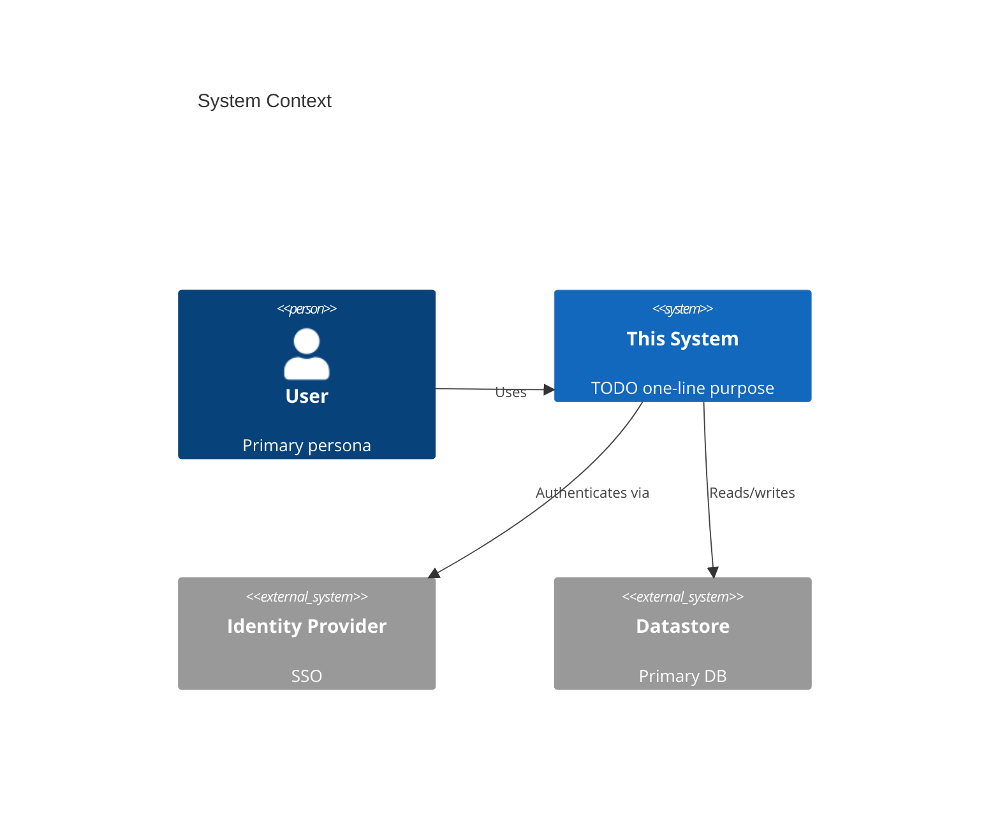

# Architecture (C4 model)

Describe the system at four zoom levels. Keep diagrams generated-from-text (Mermaid) so they diff
cleanly and stay in sync.

## 1. System Context (who uses it, what it talks to)

## 2. Containers (apps, services, stores)
TODO — the deployable units and how they communicate (protocols, sync/async).

## 3. Components (inside each container)
TODO — the major modules/responsibilities within a container. Add per-container as they stabilize.

## 4. Code (only where it earns its keep)
Link to the code; don't mirror it. Record only structure that isn't obvious from the source.

## Cross-cutting
- **Boundaries:** the rules that must not be violated (see `CLAUDE.md` §1).
- **Data flow:** request lifecycle, auth flow, background jobs.
- **Failure modes & resilience:** timeouts, retries, idempotency, degradation.
